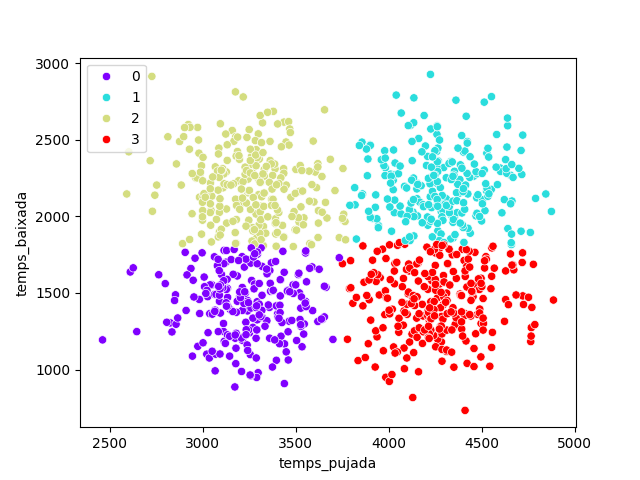

# IOC-M3-EAC6_OlavMartos
# Table of contents
1. [Introducció](#introduccio)
2. [Execució](#run)
3. [Clustering](#cluster)
4. [Llicencia](#licence)

# Introducció <a name="introduccio"></a>
Es tracta de l'exercici d'avaluació continua nº6, per el Modul nº3 del curs de IA y ML d'IOC.

Tracta de fer un projecte Python de software complet, no sols utilitzant el model sino també utilitzant
llibreries com *pylant*, *pydocs*, *MLFlow*, etc.

Es vol crear dades sintètiques per pdoer fer un anàlisis de les dades amb IA (bàsicament un probelma de clustering)

Consta de dues parts:
- generardataset: crea a la carpeta data/ dades simulades. En principi es simulen 4 comportaments de ciclistes, que donaran lloc a 4 categories/clústers.
- clustersciclistes: carrega el dataset creat amb anterioritat. Fa un EDA de les dades, les neteja, extrau les etiquetes verdaderes, visualitzar el pairplot i entrena un model de KMeans i poder predir nous valors mai vists.

# Execució <a name="run"></a>
El projecte ha sigut creat mitjançant WSL i venv, per tant es pot recrear de la mateixa forma.

Pots crear un entorn virtual fent:
```
$ python -m venv venv
 o bé:
$ virtualenv venv

$ source venv/bin/activate
```

I tot seguit instal·lar els mòduls necessaris:
```
$ pip install -r requirements.txt
```

Per executar:
```
$ cd portcanto
$ python generardataset.py
$ python clustersciclistes
```

Si clones el repositori, tots els fitxers i imatges que son creades per els scripts, ja es trobaren creades.

# Clustering <a name="cluster"></a>
Mitjançant un model de KMeans que es troba en el directori *model/clustering_model.pkl* es resol el problema de trobar els clústers per a les dades simulades.

S'obtenen 4 clústers.


# Llicència <a name="licence"></a>
Olav Martos (2025)
Llicència MIT. [LICENSE.txt](LICENSE.txt) per més detalls